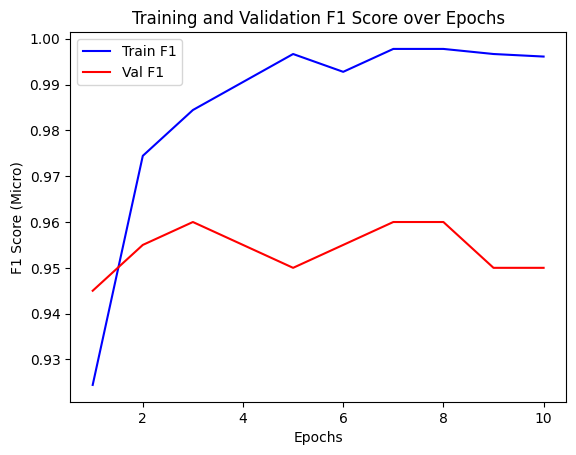
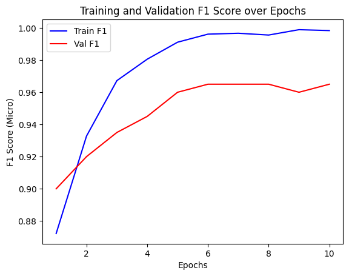

# Image Artifact Detection for Generated Images

--- 

## Pipeline
For solving this task it was decided to use pretrained model 
such as **Efficientnet** and **Resnet** for boosting binary classification task.
If results will be not enough accurate it is proposed to use ensembles from created networks. 
---

### Jupyter Notebook Workflow

1. **Data Preprocessing & Augmentation**:    Loading, cleaning, and augmenting of the dataset.
2. Model Training
3. Model Evaluation
4. Model Inference

---

### Results and metrics

As you can see both models show approximately equal F1 score on validation dataset

  <table>
    <tr>
      <td align="center">
         
        Resnet: F1 0.9650
      </td>
      <td align="center">
         
        Efficientnet:F1 0.9520 
      </td>
    </tr>
  </table>

### So as a result I dont see a need to create even more complicated solution.

